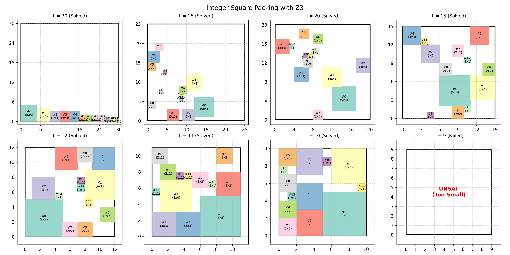

# CS517 Final Project: SMT-Based Packing

This repository implements an SMT reduction for grid-based packing problems.
The baseline is integer square packing, and the main extension is rectangle
packing with optional 90-degree rotation.

## Problem Variants

- `squares`: pack axis-aligned integer squares into an `L x L` square container.
- `rectangles_no_rotation`: pack axis-aligned rectangles into a rectangular
  container.
- `rectangles_rotation`: pack rectangles where each piece may optionally rotate.

For every piece, the solver creates integer coordinate variables for the
lower-left corner. For rotatable rectangles, it also creates a Boolean rotation
variable. Boundary constraints keep pieces inside the container, and pairwise
disjunctions enforce non-overlap.

## Setup

The project can be run with ordinary Python; `uv` is not required.

```powershell
python -m venv .venv
.\.venv\Scripts\Activate.ps1
python -m pip install -r requirements.txt
```

## Run Experiments

```powershell
python -m src.experiments --preset final
```

This writes:

- `results/summary.csv`
- `results/figures/*.png`
- `results/square_baseline_grid.png`
- `results/rectangle_experiments_grid.png`

The original square-packing visualization is kept below for comparison:



## Reports and Results

- English report: `paper/main.pdf`
- Chinese report: `paper/main_cn.pdf`
- Experiment summary: `results/summary.csv`
- Square baseline grid: `results/square_baseline_grid.png`
- Rectangle/rotation grid: `results/rectangle_experiments_grid.png`

## Solve One JSON Instance

```powershell
python -m src.solve_instance examples\rotation_witness.json --image results\rotation_witness.png
```

## Run Tests

```powershell
python -m unittest discover -s tests
```

The tests cover single-piece SAT cases, area-bound UNSAT, rectangle
non-overlap, a rotation-only feasibility witness, and JSON instance loading.

## Repository Structure

- `src/packing_solver.py`: Z3 encoding and result validation.
- `src/instances.py`: JSON input/output and deterministic instance generation.
- `src/visualize.py`: Matplotlib packing visualizations.
- `src/experiments.py`: reproducible experiment preset and CSV/image output.
- `paper/main.tex`: project report.
